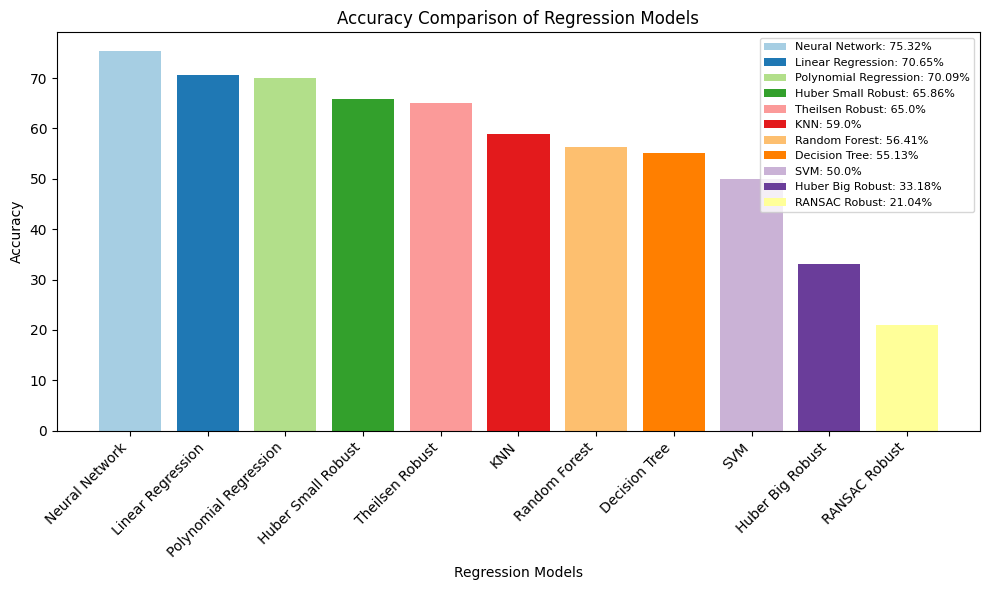

In this code, we are going to take this data.csv file, and run all types of machine learning models on it
we are aiming for highest accuracy!

Here's a barplot of the models and their performance:

All of the Things we will try
- Linear Regression -> 30 models (0.368 seconds), Accuracy: 70.65%, Editing -> ex.ipynb || Number of features: 19
- Polynomial Regression -> 30 models (0.948 seconds), Accuracy: 70.09%, Editing -> ex.ipynb (doesnt delete the columns linear did) || Number of features: 37
- Robust Regression
- - Theilsen -> 30 models (43.90 seconds), Accuracy: 61.32% saved (highest was 65%), Editing -> same as linear regression || Number of features: 19
- - Huber Data Small -> 30 models (1.87 seconds), Accuracy: 65.86%, Editing -> same as linear regression || Number of features: 19
- - RANSAC -> 30 models (5.83 seconds), Accuracy: 10% saved (21.04% highest), Editing -> same as linear regression without transformations || Number of features: 19
- - Huber Data Big -> 30 models (1.49 seconds), Accuracy: 33.18%, Editing -> same as RANSAC || Number of features: 19
- Decision Tree -> 30 models (0.799 seconds), Accuracy: 55.13%, Editing -> all done in the file starting from the polynomial dataset || Number of features: different depending on PCA
- Random Forest -> 30 models (835 seconds), Accuracy: 56.41% Editing: all done in the file starting from polynomial dataset || Number of features: different depending on PCA
- SVM -> 30 models (0.806 seconds), Accuracy: 50%, Editing: all done in file, hyperparameters picked (info below) || Number of features: 32
- KNN -> 30 models (0.937 seconds), Accuracy: 59.0% saved (61% highest), Editing: all done in file, hyperparameter: n_neighbors = 4 || Number of features: 31
- Neural Network -> 30 models (149 seconds), Accuracy: 75.32% highest(with only 5 epochs) (71.43% saved), Editing: hyperparameters tuned using neural.py || Number of features: 32

Methods Using Arbitrary Bins:
- Decision Tree
- Random Forest
- SVM
- KNN
- Logistic Regression
- Neural Network

Up there, we will record a couple statistics

1. The accuracy of the model
2. The amount of time the model requires to run
3. All preprocessing needed to use the model

For everything we will be predicting the mosquito counts in the dataframe
Lets go!

Linear Regression:
- We took out unncessary columns
- changed time to be counting uip from 0 for each month starting at 01-2018
- deleted nas
- took out these columns because they are not linearlly related
- - latitude, longitude, minimum 10 meter v wind, src min, sde max, keys, sde min, evergreen broadleaf, decidous broadlead, mixed other trees, shurbs, regularly flooded vegetation

Now dealing with the rest of the columns

First: population -> did the log transformation
Second: herbaceous vegetation -> did the square root transformation

Polynomial Regression:
- same as linear dataset except did not take out the columns that were not linearlly related

Robust Regression:
- It is better with outliers. We are going to try three models. 
- - Theil-Sen is good for small outliers, so we will use it with the linear dataset
- - RANSAC is good for strong outliers, so we will use a new dataset that does not do the transformations
- - Huber Regressor is good at both, so we will try both datasets on it

Outliers found in:
Maximum Snow Depth, EvergreenBoradleef, Deciduous Broadleeft, Shrubs, OpenWater
Decision Tree
- Did PCA to bring the number of components down to 6 to simplify
- After testing many different maximum depths, the best one that kept it simple was a maximum depth of 5
- I had to figure out a way to classify mosquitos. I ended up going with 4 different bins, but this could be changed. Bins were 0 or 1, 2, 3 or 4, greater than 4, this is from the already log transformed data

Random Forest:
Based on each random forest, specific hyperparameters such as number of estimators and max depth can be chosen, so I had to write a function "get_params" that would dynamically generate parameters for each forest, which took much longer

- Used some bins and decision tree (could be bad, but is easy to change later)
- Use PCA just like decision tree

SVM:
- good with lots of variables, so no PCA, but I must remove outliers and standardize
- had to do testing to find best hyperparameters, settled on a polynomial kernel with a degree of 3 and a small margin of 0.1

KNN
- all editing done in file, just used mixmax scaler

Neural Network
- the neural network was first created with basic hyperparameters and used the Standard Scaler
- over many iterations, all the specific hyperparameters were reached with highest accuracy in mind
